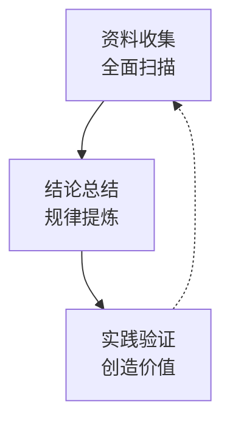

import { ArticleLayout } from '@/components/ArticleLayout'

export const article = {
  author: 'Liweinan',
  date: '2022-03-15',
  title: '设计洞察：设计师的底层思维框架与实战手册',
  description:
    '设计洞察是从庞杂信息中提炼规律、定位核心问题，并找到最优解的系统化思维过程。它是连接用户价值、商业价值与技术可行性的桥梁，是设计师避免沦为"美工"的核心竞争力。',
}

export const metadata = {
  title: article.title,
  description: article.description,
}

export default (props) => <ArticleLayout article={article} {...props} />

在瞬息万变的产品世界中，是什么让顶尖设计师脱颖而出？答案并非炫酷的软件技巧，而是一种名为 "设计洞察" 的系统性思维能力。它是一切卓越设计的起点。  
简单来说，设计洞察是连接用户价值、商业价值与技术可行性的桥梁，是设计师避免沦为"美工"的核心竞争力。

## 核心定义：什么是设计洞察？

设计洞察，是从庞杂信息中提炼规律、定位核心问题，并找到最优解的系统化思维过程。它回答了三个关键问题：  

**为什么做？** —— 确保方向正确，符合商业与用户需求  
**怎么做？** —— 提供清晰路径，让方案有据可依  
**结果如何？** —— 通过实践验证价值，并持续优化  

## 价值驱动：为什么必须掌握设计洞察？  
缺少业务洞察，设计方案与产品目标、市场策略脱节，难以获得支持；   
缺少用户洞察，容易陷入"我觉得用户需要"的主观臆断，无法解决真实痛点，无法深入理解用户的实际使用场景、行为逻辑和情感需求；   
缺少技术洞察，设计成为"空中楼阁"，开发实现困难，团队协作效率低下，无法评估设计方案的可行性。   

## 核心方法论：设计洞察的通用流程

设计洞察遵循一个严谨的"发现问题-解决问题"的闭环逻辑，其核心流程如下图所示：

### 步骤一：资料收集——全面扫描，避免盲区
**核心原则**：MECE穷尽法则，即相互独立、完全穷尽。像侦探一样，不放过任何线索；    
**行动指南**：快速、多元地搜集信息，包括用户访谈、业务数据、竞品分析、技术文档等。    

### 步骤二：结论总结——规律提炼，形成策略
**核心方法**：归纳法。将零散的信息去伪存真、分门别类，从中提炼出核心规律与共性；  
**目标产出**：全面的结论，而非片面观点。例如，不是"蓝色好看"，而是"基于品牌调性与用户测试，深蓝色能传递专业与信任感"。  

### 步骤三：实践验证——创造价值，闭环迭代
**核心理念**：实践是检验真理的唯一标准；   
**行动指南**：将策略应用于真实项目，用数据（如点击率、用户满意度）和反馈来验证洞察的有效性，并持续优化。

## 实战演练：设计洞察的应用场景

### 场景1：竞品分析——在模仿中超越
**目的**：快速学习，明确自身定位，找到差异化创新点；  
**确定维度**：明确要研究什么（如：用户体验、视觉风格、功能布局）；  
**选择竞品**：直接竞争品、间接替代品、行业标杆；  
**拆解分析**：将竞品"大卸八块"，研究其如何解决特定问题；  
**归纳总结**：取其精华，并思考如何做得更好。  

### 场景2：视觉洞察——从"感觉"到"法则"
**案例**：奢侈品品牌的辅助色研究；  
**重奢品牌**（如Hermès）：多用低明度、低纯度的类比色系，营造内敛、经典感；   
**潮奢品牌**（如Off-White）：善用高明度、高对比度的互补色系，彰显个性、潮流感；  
**价值**：掌握色彩背后的心理密码，让设计有据可循。

## 如何修炼：设计洞察力的养成

设计洞察力并非天赋，而是可以通过刻意练习培养的习惯。

**保持好奇心**：对任何事物多问一个"为什么"；  
**建立信息源**：定期浏览专业网站（如ADC、TDC）、阅读行业报告、体验各类产品；  
**勤于总结**：建立个人知识库，将零散的发现整理成体系化的观点；  
**积极验证**：敢于在工作和个人项目中实践自己的想法，不怕试错。

设计洞察，是设计师从"执行者"跃升为"策略家"的关键阶梯。它让设计不再是凭感觉的创作，而是有方法、有逻辑、可衡量的专业 discipline。掌握它，你将为你的设计赋予真正的说服力与生命力。
